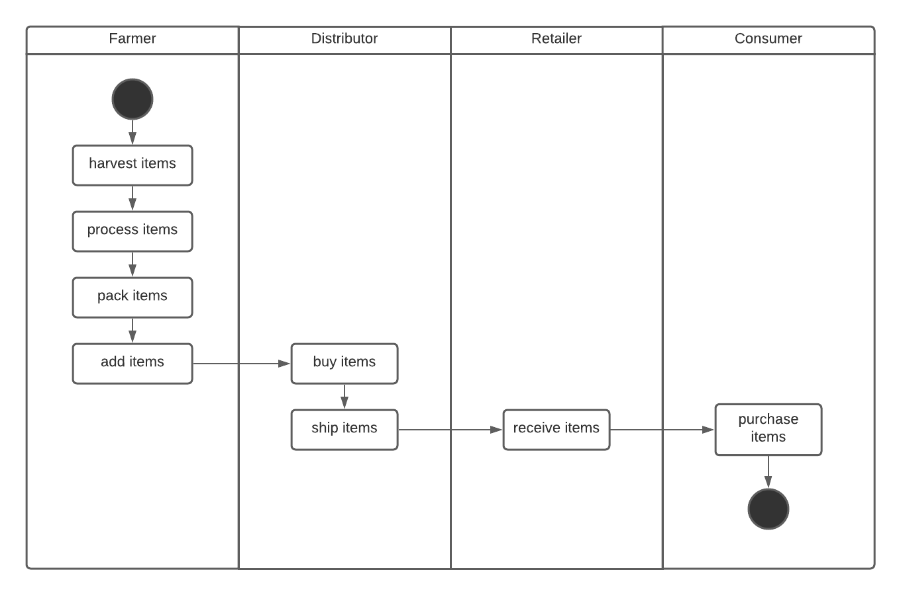
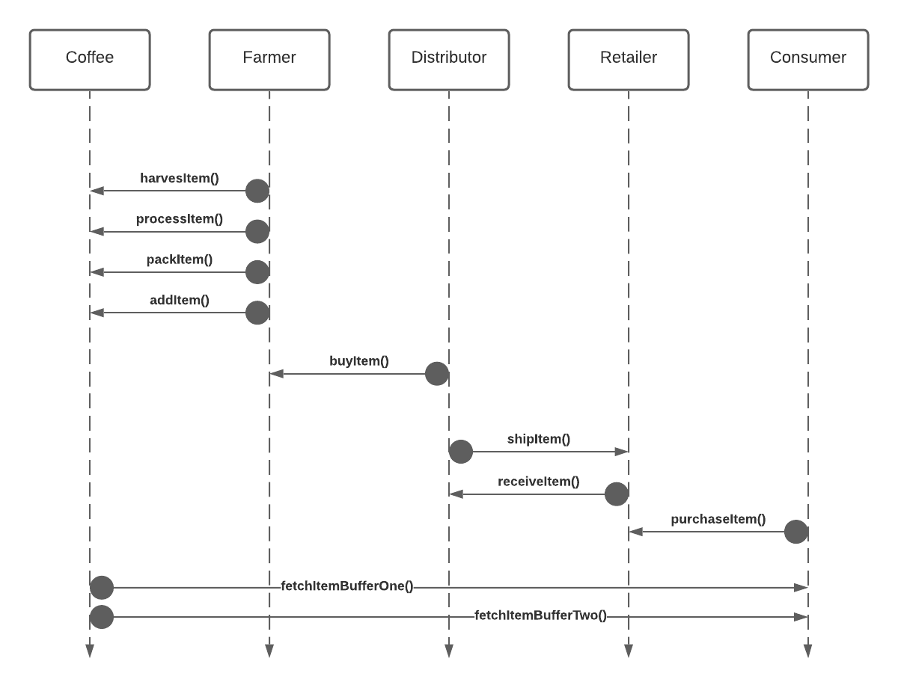
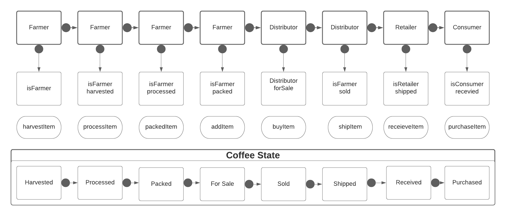

# Supply chain & data auditing

This repository containts an Ethereum DApp that demonstrates a Supply Chain flow between a Seller and Buyer. The user story is similar to any commonly used supply chain process. A Seller can add items to the inventory system stored in the blockchain. A Buyer can purchase such items from the inventory system. Additionally a Seller can mark an item as Shipped, and similarly a Buyer can mark an item as Received.

The DApp User Interface when running should look like...


## UML







## Getting Started

These instructions will get you a copy of the project up and running on your local machine for development and testing purposes. See deployment for notes on how to deploy the project on a live system.

### Prerequisites

Please make sure you've already installed ganache-cli, Truffle and enabled MetaMask extension in your browser.

```
Give examples (to be clarified)
```

### Installing

A step by step series of examples that tell you have to get a development env running

Clone this repository:

```
git clone https://github.com/udacity/nd1309/tree/master/course-5/project-6
```

Change directory to ```project-6``` folder and install all requisite npm packages (as listed in ```package.json```):

```
cd project-6
npm install
```

Launch Ganache:

```
ganache-cli -m "spirit supply whale amount human item harsh scare congress discover talent hamster"
```

Your terminal should look something like this:


In a separate terminal window, Compile smart contracts:

```
truffle compile
```

Your terminal should look something like this:


This will create the smart contract artifacts in folder ```build\contracts```.

Migrate smart contracts to the locally running blockchain, ganache-cli:

```
truffle migrate
```

Your terminal should look something like this:


Test smart contracts:

```
truffle test
```

All 10 tests  pass.


In a separate terminal window, launch the DApp:

```
npm run dev
```

## Built With

* [Ethereum](https://www.ethereum.org/) - Ethereum is a decentralized platform that runs smart contracts
* [IPFS](https://ipfs.io/) - IPFS is the Distributed Web | A peer-to-peer hypermedia protocol
to make the web faster, safer, and more open.
* [Truffle Framework](http://truffleframework.com/) - Truffle is the most popular development framework for Ethereum with a mission to make your life a whole lot easier.


## Acknowledgments

* Solidity
* Ganache-cli
* Truffle


Transaction Address: https://rinkeby.etherscan.io/tx/0xfb4221338e45eb0e9e281dc83928a465a6b9bb6921a97601c3b884cc2ff0b2f3 Contract Address: `0x27d8d15cbc94527cadf5ec14b69519ae23288b95`

When you have any logistical chain you need to know where things orginally comes from. If you're having coffee you want to make sure the beans are harvested ethically and effieciently. There is massive logisitcal process from harvesting the beans, processing them, selling them to distributors, and then to customers where there isn't always a lot of transparency and trust. By building a blockchain solution, the consumer can know exactly when and where the beans were harvest and see it through it's lifecycle. Ready to arrive to them. This is one global, scalable solution that companies and conusmers could choose to adopt and advocate for.

Versions: Truffle v5.3.3 (core: 5.3.3) Solidity v0.5.16 (solc-js) Node v10.16.0 Web3.js v1.3.5

